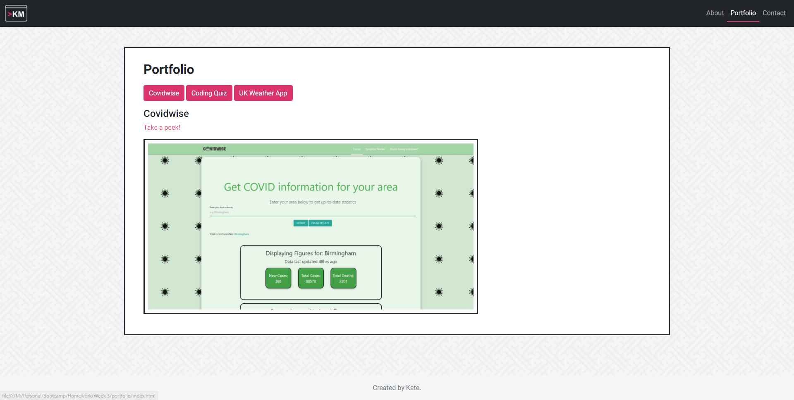

# portfolio
This is a site created to eventually hold the contents of my work, otherwise known as a portfolio.
Inside you'll find a bit about me, as well as a contact form in order to get in touch with me.

## Contents
Section | Description
------------ | -------------
[Access](#access) | Screenshots of the site and information on Horiseon
[About Me](#aboutme) | Information on the about me page
[Contact](#contact) | Information on the contact page
[Portfolio](#portfolio) | Information on the portfolio page
[Consistencies](#consistencies) | Components which are used across the whole site
[Licence](#licence) | Licence for the source code

## Access
You can access the site via [this link](https://kvtemadden.github.io/portfolio/)

And you can access the GitHub Repo via [this link](https://github.com/kvtemadden/portfolio)

Languages used: jQuery, CSS, HTML, Bootstrap.

## About Me

The content on this page gives a little bit of information about me.

I customised it by adding a hero section to make the page a little bit more interesting.

This section includes my CV, LinkedIn profile and GitHub links too.

There are also links to my social media accounts, which are accompanied by the logos for the particular sites.

You'll see to the right of the text are two images, which are both formatted with a border and height/width to maintain a square until the page is too small. In the case that it is too small, for visibility, the image reduces in width and gains in height.

## Contact

The contact page has a form that doesn't currently submit correctly, but after some research I found that the information does actually get sent to the page.

The user will input their name, email and the message they want to send before they click on the bootstrap button "Submit message". At some point I plan to come back to this and set it up correctly, but I'm not entirely sure how to access the server at this point.

## Portfolio

This part of the site has buttons which show the relevant project on click.

Similar to an accordian, if any buttons are showing expanded content then they'll close and the new click will open so content isn't pushed down the page and it supports better UX.

I have added a .frame class which adds a frame to the images, similar to those on the about page.

The images are all responsive to the page/device resolution.

## Consistencies
Below are the constant items that are maintained across the site.

### Navigation Bar
The navigation bar is a dark theme, pulled from Bootstrap, and is responsive to device size.

If a user is on a page, the link that links to that page (e.g. if you're on the About page then the About text in the navigation bar) will display in a lighter colour to the other links in the navigation bar and display with a border bottom.

I've also added in a logo for my site, which is also shown in the favicon. Clicking the logo will take you back to the index page.

### Sticky footer
As a bonus, I took inspiration from the Bootstrap sticky footer bar but I centred the text instead. This is constantly in display on all devices and there is always a 10px gap between the content on the page and the footer when the user scrolls to the bottom of the page.

### Boostrap grid system
There is a section area which contains all of the main content on the page. This area is created using the Bootstrap grid system in order to allow a simple responsive layout.

This is identified as the content between the `<section>` tags.

All of the content in these areas are displayed on a white background which has a border (the colour of which matches the navigation bar).

## Licence
> This site was created under the standard MIT licence.

